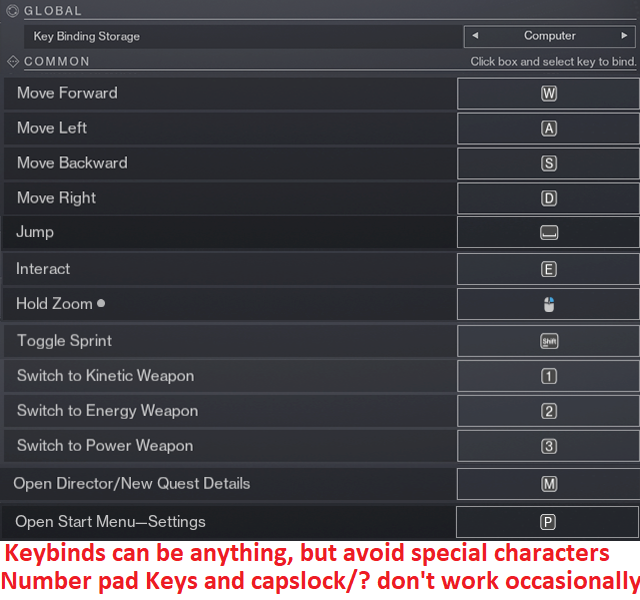

# Double Loot AFK Exotic Class Item Farm

## About the Macro

This macro farms exotic class items fully automatically by opening chests in the Pale Heart.

There have been other macros similar to this recently (inluding ones where you can tab out while you use them, more info on that below) however this one is different in that it collects 2 chests every time instead of 1. This small change makes the macro much more efficent (nearly 2x) but also much more complex. 

Because of this increase in complexity the in game settings and setup matter much more than with similar macros, so be sure to fully read through and follow the instructions below.

If you are interested in learning more about how this macro works or about similar macros that work while you are tabbed out of the game join the [discord](https://discord.gg/KGyjysA5WY).

## Support
If you like this macro and want to support my work, you can do so on [Ko-Fi](https://ko-fi.com/a2tc_awesome_guy). Your support is greatly appreciated and helps me continue developing and improving macros like this. :3

## Required Settings
- AutoHotKey Version 1.1.37 is currently required.
Download [Here](https://autohotkey.com/download/1.1/AutoHotkey_1.1.37.02_setup.exe)
- Disable any Color Adjusting Overlays you may have
- Ensure HDR and Nightlight are OFF in Windows display settings (sometimes a restart is required after this change)

## Destiny Settings
### Sensitivity
- **Look Sensitivity**: Set to `6`
- **ADS Sensitivity Modifier**: Set to `1.0`
- **Aim Smoothing**: `Off`

  

### Bindings
- **Key Binding Storage**: Set to `Computer`
- **Toggle Sprint**: If you don't normally use toggle sprint assign this key to anything (example: set to `p`)
- **Bind Settings Key**: Assign to anything, just needs to be assigned

### Display Settings
- **Window Mode**: Windowed
- **Resolution**: `1280 x 720`
- **Frame Rate Cap Enabled**: `On`
- **Frame Rate Cap**: `30 FPS`
- **Field of View**: `105`
- **Brightness**: Set to `7`
- **Screen Bounds**: Ensure screen bounds are set to `Max`
- You May need to Press W and D to max the screen bounds even if they look already maxed. Hit Enter to save.

  

### Visual Settings
- **HDR**: Disabled
- **Chromatic Aberration**: Disabled
- **Film Grain**: Disabled

  

- **HUD Opacity**: Set to `Full`
- **Colorblind Mode**: `Off`
- **Reticle Location**: `Center`

  

## Character Requirements
- **100 Mobility**: Yes, on every class (even warlock)
- **Jump**: Warlock - Burst Glide | Hunter - Triple Jump | Titan - Catapult Lift
- **No Movement Exotics**: No ST0MP-EE5, no TRANSVERSIVE STEPS, etc.
- **Weapon**: Get and equip the blue rarity sniper AACHEN-LR2 from collections, it can be either the kinetic or void one.
- **HEAVY Sword**: You must have a HEAVY sword equipped, does not matter what HEAVY sword.
- **Ghost Mod**: You must equip the `Wombo Detector` ghost mod (alternatively the `Expert Tracker` and `Treasure Hunter` ghost mods will actually work better but are no longer obtainable)

  

## How to Use

1. **Install AutoHotkey**
   - Make sure you have [AutoHotkey v1.1.37](https://www.autohotkey.com/download/ahk-install.exe) (not AHK v2) installed on your computer.
   
2. **Download the Latest Release**
   - Download the latest release of the macro from the [releases page](https://github.com/A2TC-YT/afk-class-item-double-chest/releases/latest). Once downloaded, unzip the file to a folder of your choice.
   - Do Not Compile the scripts. They are intended to run in their raw .ahk state.

3. **Ensure Settings Match**
   - Before running the macro, ensure all your settings match the ones listed in the "Required Settings" section above. This includes sensitivity, bindings, display settings, and additional settings.

4. **Run the Macro**
   - Navigate to the unzipped folder and run `double_chest_farm.ahk` by double-clicking it. `DO NOT Compile the scripts into an exe.`
   - In the input box be sure to select what character you are using, what position they are on in the character select screen, and which aachen you have equipped.
   - If the UI for the stats is off the screen you can move the Destiny window and press F4 to reload the script.

5. **Keybinds**
   - Use the following keybinds to control the macro:
     - **Start Macro**: Press `F3`
     - **Stop Macro**: Press `F4`
     - **Close Macro**: Press `F5`

## Further Help
For more help or to ask other questions please join the [discord](https://discord.gg/KGyjysA5WY).
