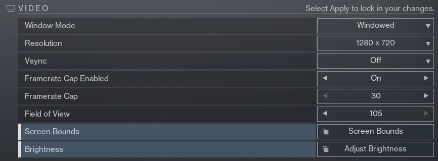

# Double Loot AFK Exotic Class Item Farm

## About the Macro

This macro farms exotic class items fully automatically by opening chests in the Pale Heart.

There have been other macros similar to this recently (inluding ones where you can tab out while you use them, more info on that below) however this one is different in that it collects 2 chests every time instead of 1. This small change makes the macro much more efficent (nearly 2x) but also much more complex. 

Because of this increase in complexity the in game settings and setup matter much more than with similar macros, so be sure to fully read through and follow the instructions below.

If you are interested in learning more about how this macro works or about similar macros that work while you are tabbed out of the game join the [discord](https://discord.gg/KGyjysA5WY).

## Required Settings

### Sensitivity
- **Look Sensitivity**: Set to `6`
- **ADS Sensitivity Modifier**: Set to `1.0`

### Bindings
- **Key Binding Storage**: Set to `Computer`
- **Toggle Sprint**: If you don't normally use toggle sprint assign this key to anything (example: set to `p`)
- **Bind Settings Key**: Assign to anything, just needs to be assigned

### Display Settings
- **Window Mode**: Windowed
- **Resolution**: 1280 x 720
- **Frame Rate Cap Enabled**: `On`
- **Frame Rate Cap**: 30 FPS
- **Brightness**: Set to `7`
- **Screen Bounds**: Ensure screen bounds are set to max

### Visual Settings
- **HDR**: Disabled
- **Chromatic Aberration**: Disabled
- **Film Grain**: Disabled

- **HUD Opacity**: Set to `Full`
- **Colorblind Mode**: Disabled

## Character Requirements
- **100 Mobility**: Yes, on every class (even warlock)
- **No Movement Exotics**: No ST0MP-EE5, no TRANSVERSIVE STEPS, etc.
- **Weapon**: Get and equip the **kinetic** blue rarity sniper AACHEN-LR2 from collections
- **Ghost Mod**: You mest equip the `Wombo Detector` ghost mod (alternatively the `Expert Tracker` and `Treasure Hunter` ghost mods will actually work better but are no longer obtainable)

## How to Use

1. **Install AutoHotkey**
   - Make sure you have [AutoHotkey](https://www.autohotkey.com/) installed on your computer. If you don't have it, download and install it from the official website.

2. **Download the Latest Release**
   - Download the latest release of the macro from the [releases page](link-to-releases-page). Once downloaded, unzip the file to a folder of your choice.

3. **Ensure Settings Match**
   - Before running the macro, ensure all your settings match the ones listed in the "Required Settings" section above. This includes sensitivity, bindings, display settings, and additional settings.

4. **Run the Macro**
   - Navigate to the unzipped folder and run the `double_chest_farm.ahk` file by double-clicking it.
   - If the UI for the stats is off the screen you can move the Destiny window and press F4 to reload the script.

5. **Keybinds**
   - Use the following keybinds to control the macro:
     - **Start Macro**: Press `F3`
     - **Stop Macro**: Press `F4`
     - **Close Macro**: Press `F5`

## Support
- For any additional support or to ask any questions join the [discord](https://discord.gg/KGyjysA5WY)
- And if you wanna support me you can [here :3](https://ko-fi.com/a2tc_awesome_guy)
